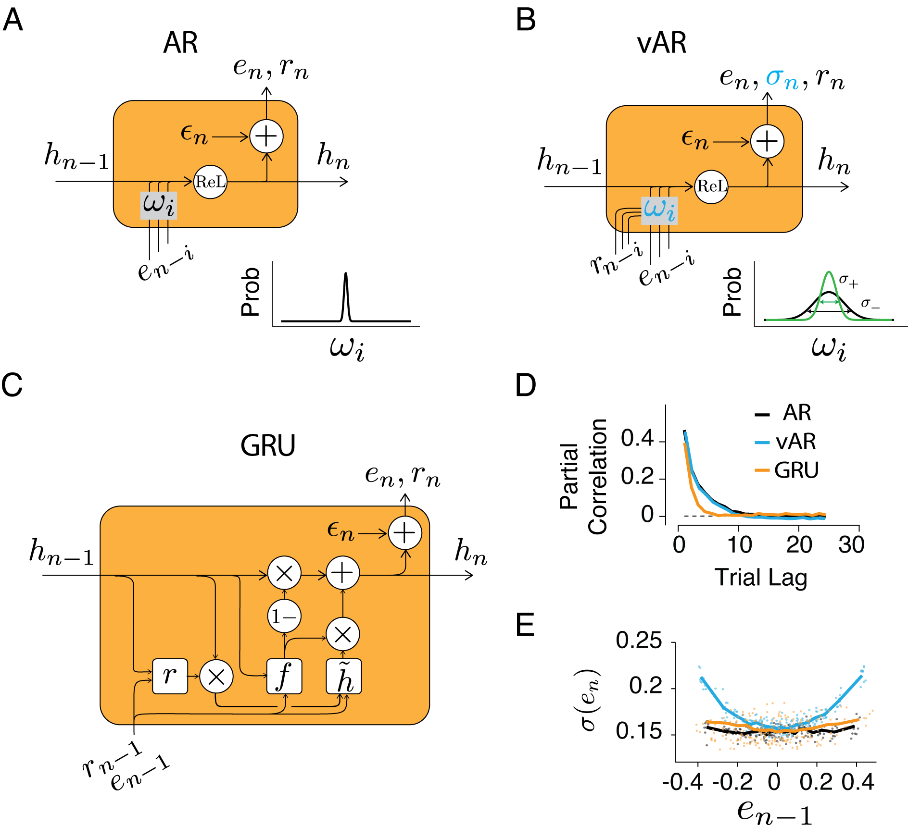
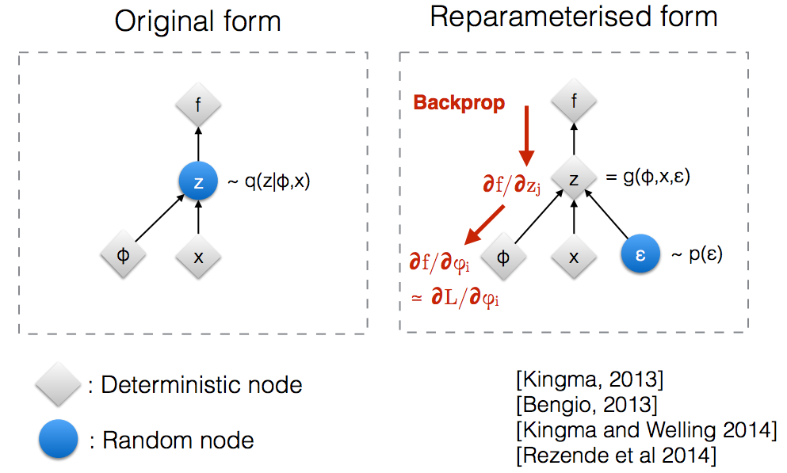

# Three types of recurrent neural networks (RNN) for time series prediction with reinforcement 

ARNN: autoregressive RNN

vARNN: weight varying autoregressive RNN

GRU: Gated Recurrent Unit, a simplified LSTM

## [paper](https://arxiv.org/abs/2205.04347)

  

## How to backprop through a random node?

  

